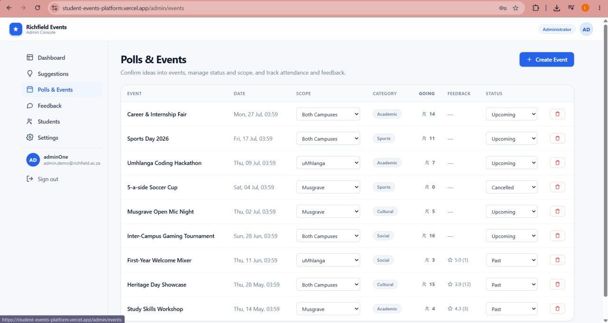
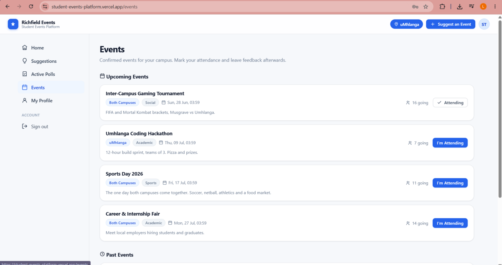
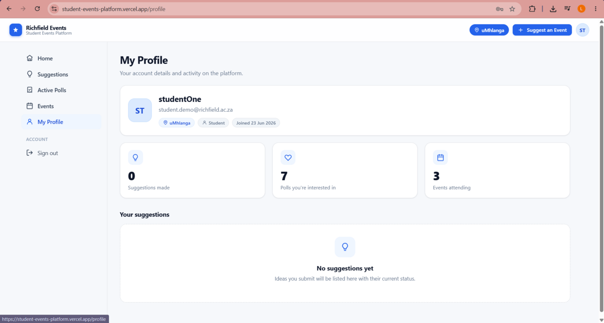
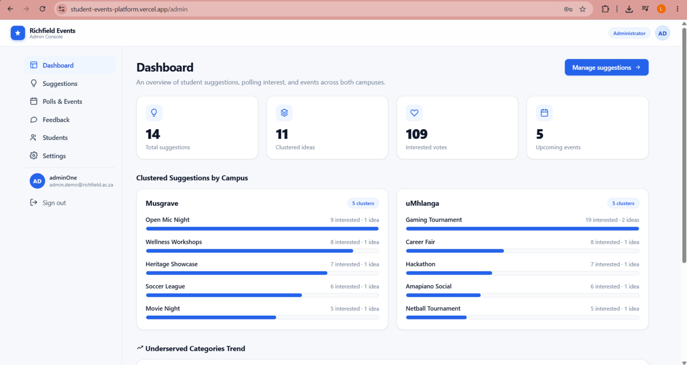
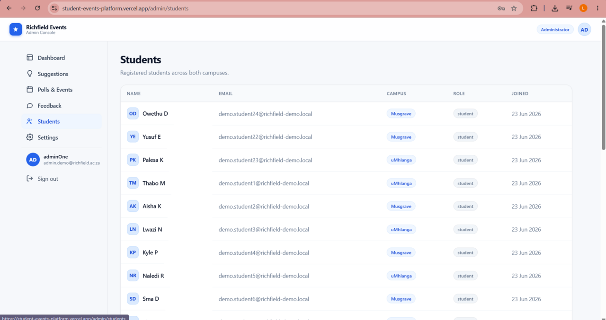
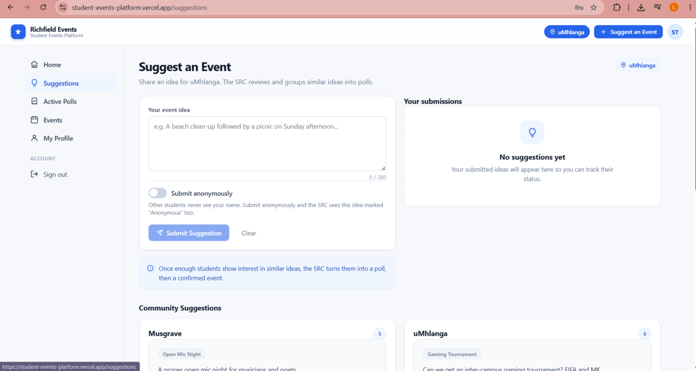
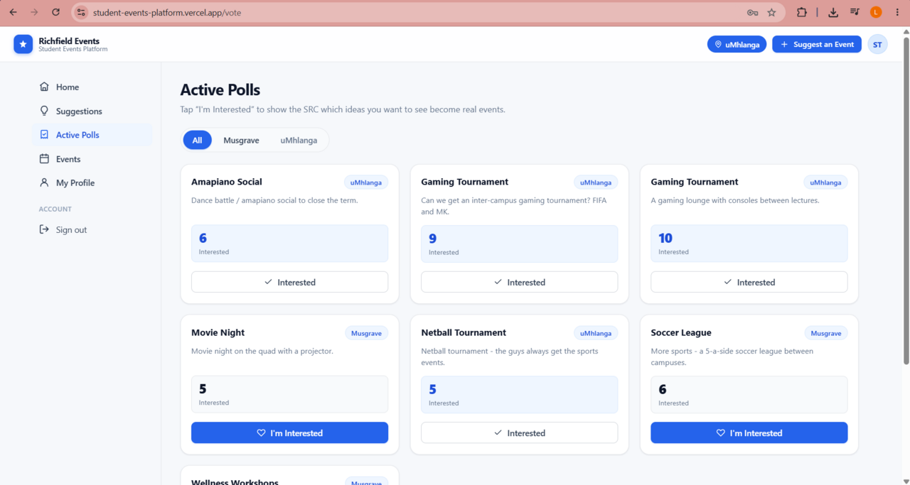

# 🎓 Richfield Student Events Platform

A full-stack web app that closes the loop between **what students want** and **what the SRC actually puts on**. Students submit and upvote event ideas; an AI pass clusters duplicate suggestions and surfaces demand; the SRC turns the strongest signals into real, scheduled events and collects post-event feedback — all scoped to Richfield's **Musgrave** and **uMhlanga** campuses.

<p align="center">
  <a href="https://student-events-platform.vercel.app"><strong>🔗 Live Demo</strong></a>
  &nbsp;·&nbsp;
  <a href="https://github.com/LinMhlaDoRh/Student-Events-Platform"><strong>Source</strong></a>
</p>

<p align="center">
  
  
  
  
</p>

<p align="center">
  
</p>

---

## ✨ Try it instantly (Demo Mode)

The sign-in screen has two one-click demo buttons — no account creation required:

| Role | Email | Password |
|------|-------|----------|
| 👨‍🎓 Student | `student.demo@richfield.ac.za` | `demo1234` |
| 🛡️ SRC Admin | `admin.demo@richfield.ac.za` | `demo1234` |

> The demo database is pre-seeded with events, suggestions, votes, and feedback so every screen is populated and clickable.

---

## 📋 Table of contents

- [Features](#-features)
- [Screenshots](#-screenshots)
- [Tech stack](#-tech-stack)
- [Architecture](#-architecture)
- [Project structure](#-project-structure)
- [Database schema](#-database-schema)
- [Getting started](#-getting-started)
- [Database setup (SQL order)](#-database-setup-sql-order)
- [AI suggestion clustering](#-ai-suggestion-clustering)
- [Seeding demo data](#-seeding-demo-data)
- [Deployment](#-deployment)
- [Available scripts](#-available-scripts)
- [Roadmap](#-roadmap)
- [Author](#-author)

---

## 🚀 Features

### Student experience
- **Secure auth** — email/password sign-up & sign-in with campus selection, password-strength meter, and password reset.
- **Submit ideas** — propose event suggestions (with optional **anonymous** posting) tagged to a campus.
- **Upvote demand** — register interest in others' ideas; one vote per student per idea.
- **Browse events** — see upcoming events scoped to the student's campus.
- **RSVP & feedback** — mark attendance and leave a star rating + comment after events.
- **Profile** — manage personal details and campus.

### SRC admin experience
- **Dashboard** — at-a-glance demand and activity metrics, broken down by campus.
- **Suggestions review** — see clustered ideas ranked by interest, with status workflow (`submitted → review → considering → approved/rejected`).
- **Underserved-categories trend** — highlights categories where students show demand but no events exist yet.
- **Events management** — create, schedule, and manage events (campus-scoped or both).
- **Students** — directory of registered students per campus.
- **Feedback analytics** — average rating, response counts, rating distribution, and attendance breakdown.
- **Settings** — platform/campus overview.

### AI
- **One-click suggestion clustering** — a Supabase Edge Function batches every suggestion to Google Gemini, which groups duplicates under a shared `cluster_label` and assigns a category.

---

## 📸 Screenshots

### Student

| Student dashboard | Suggest an event |
|---|---|
|  |  |

| Active polls | Events |
|---|---|
|  |  |

| Profile | |
|---|---|
|  | |

### SRC Admin

| Admin dashboard | Suggestions review |
|---|---|
|  |  |

| Events management | Feedback analytics |
|---|---|
|  |  |

| Students directory | |
|---|---|
|  | |

---

## 🧱 Tech stack

| Layer | Technology |
|-------|-----------|
| Frontend | React + [Vite](https://vitejs.dev/) |
| Routing | `react-router-dom` v7 |
| Icons | `lucide-react` (brand marks inlined as SVG) |
| Backend / DB | [Supabase](https://supabase.com) — Postgres, Auth, Row-Level Security, Realtime |
| Serverless AI | Supabase Edge Function (Deno) + Google Gemini |
| Monitoring | Vercel Analytics + Speed Insights |
| Hosting | [Vercel](https://vercel.com) (SPA) |
| Styling | Hand-authored CSS design system (`theme.css`), no UI framework |

---

## 🏗 Architecture

```
  React (Vite SPA)  ──HTTPS──▶  Supabase
  ├─ Auth (session)             ├─ Auth (users)
  ├─ Student views              ├─ Postgres + Row-Level Security
  ├─ Admin views                ├─ Realtime (live vote/suggestion updates)
  └─ "Analyse Suggestions" ───▶ └─ Edge Function: cluster-suggestions ──▶ Google Gemini
```

- **Role-based routing** — `App.jsx` reads the signed-in user's `role` from `public.users`; admins land on `/admin`, students on `/dashboard`. Admin routes are guarded by an `AdminRoute` wrapper.
- **Security model** — every table is protected by RLS. Roles are assigned server-side (`handle_new_user` defaults everyone to `student`), and a `prevent_role_change` trigger blocks self-promotion; admins are granted explicitly.
- **Campus scoping** — a `my_campus()` helper and policies ensure students only see content relevant to their campus.

---

## 📁 Project structure

```
Student-Events-Platform/
├─ index.html
├─ vite.config.js
├─ vercel.json                 # SPA rewrite → index.html
├─ .env.example
├─ docs/screenshots/           # images used in this README
├─ src/
│  ├─ main.jsx                 # app entry
│  ├─ App.jsx                  # routing + role-based redirects
│  ├─ supabaseClient.js        # Supabase client (reads VITE_ env vars)
│  ├─ pages/
│  │  ├─ SignIn.jsx  SignUp.jsx  ResetPassword.jsx
│  │  ├─ Dashboard.jsx  Suggestions.jsx  Voting.jsx  Events.jsx  Profile.jsx
│  │  └─ AdminDashboard.jsx  AdminSuggestions.jsx  AdminEvents.jsx
│  │     AdminFeedback.jsx  AdminStudents.jsx  AdminSettings.jsx
│  ├─ components/
│  │  ├─ StudentLayout.jsx  AdminLayout.jsx
│  │  ├─ ui.jsx  cards.jsx  icons.jsx   # reusable UI primitives
│  ├─ lib/
│  │  ├─ useProfile.js         # loads current user's profile/role
│  │  └─ format.js             # date/format helpers
│  └─ *.css                    # theme.css design system + page styles
└─ supabase/
   ├─ phase1-auth.sql          # users table, RLS, signup trigger
   ├─ phase2-admin-read.sql    # admin read policies, is_admin()
   ├─ phase2-anonymous.sql     # anonymous suggestions + categories
   ├─ phase3-ai.sql            # AI cluster_label support
   ├─ demo-seed.sql            # demo accounts + sample data
   └─ functions/
      └─ cluster-suggestions/  # Gemini Edge Function
```

---

## 🗄 Database schema

| Table | Purpose |
|-------|---------|
| `users` | Profile mirror of `auth.users` — `email`, `full_name`, `campus`, `role` (`student`/`admin`). |
| `suggestions` | Student event ideas — `text`, `campus`, `category`, `cluster_label`, `status`, `anonymous`, `submitted_by`. |
| `votes` | Interest signals — unique per `(suggestion, user, vote_type)`. |
| `events` | Scheduled events — `title`, `description`, `campus_scope`, `category`, `status`, `event_date`. |
| `event_attendees` | RSVPs — unique per `(event, user)`. |
| `feedback` | Post-event ratings (1–5), comment, attendance — unique per `(event, user)`. |

Key rules enforced in SQL:
- `campus` ∈ `{musgrave, umhlanga}` for users/suggestions; events also allow `both`.
- `category` ∈ `{sports, social, academic, cultural, other}`.
- `suggestions.submitted_by` is **NOT NULL** — anonymity is handled by the `anonymous` flag, not by removing the author.

---

## ⚙️ Getting started

### Prerequisites
- **Node.js** 18+ and npm
- A free **Supabase** project
- (Optional, for AI) a **Google AI Studio** API key

### 1. Clone & install
```bash
git clone https://github.com/LinMhlaDoRh/Student-Events-Platform.git
cd Student-Events-Platform
npm install
```

### 2. Configure environment
Copy the example and fill in your Supabase project values:
```bash
cp .env.example .env
```
```env
VITE_SUPABASE_URL=https://<your-project-ref>.supabase.co
VITE_SUPABASE_ANON_KEY=<your-anon-or-publishable-key>
```
> Only these two are needed by the frontend. The Gemini key is **not** a frontend variable — it's set as a Supabase Edge Function secret (see [AI clustering](#-ai-suggestion-clustering)).

### 3. Run the database setup
In the Supabase **SQL Editor**, run the phase files in order (see next section).

### 4. Start the dev server
```bash
npm run dev
```
App runs at `http://localhost:5173`.

---

## 🧩 Database setup (SQL order)

Run these in the Supabase SQL Editor **in order**:

1. `supabase/phase1-auth.sql` — `users` table, RLS, and the signup trigger.
2. `supabase/phase2-admin-read.sql` — admin read policies + `is_admin()`.
3. `supabase/phase2-anonymous.sql` — anonymous suggestions + category column.
4. `supabase/phase3-ai.sql` — `cluster_label` support for AI.

Then, to create your first admin, sign up normally and promote that account:
```sql
alter table public.users disable trigger users_no_self_role_change;
update public.users set role = 'admin' where email = 'you@example.com';
alter table public.users enable trigger users_no_self_role_change;
```
> The trigger is disabled briefly because `prevent_role_change` blocks role edits from the SQL Editor (where there's no admin session).

---

## 🤖 AI suggestion clustering

The `cluster-suggestions` Edge Function sends all suggestions to Google Gemini in one batched call, groups similar ideas under a shared `cluster_label`, and assigns each a category.

**Deploy & configure:**
```bash
# deploy the function
supabase functions deploy cluster-suggestions

# set secrets (SUPABASE_* are injected automatically — don't set those)
supabase secrets set GEMINI_API_KEY=<your-google-ai-key>
supabase secrets set GEMINI_MODEL=gemini-2.5-flash   # optional; defaults to gemini-2.0-flash
```
Admins trigger it from the **Analyse Suggestions** button on the admin Suggestions page.

---

## 🌱 Seeding demo data

`supabase/demo-seed.sql` populates a fully clickable demo:

1. **First**, create the two demo accounts by signing them up through the app:
   - `student.demo@richfield.ac.za` / `demo1234`
   - `admin.demo@richfield.ac.za` / `demo1234`
2. **Then** run `supabase/demo-seed.sql` in the SQL Editor. It will:
   - promote `admin.demo` to admin and set both campuses,
   - reset old demo content, and
   - seed ghost students, events, suggestions, votes, attendees, and feedback.

The seed is **idempotent** — safe to re-run. After promoting the admin, **sign out and back in** so the new role is picked up.

---

## ▲ Deployment

Deployed on **Vercel** as a single-page app.

1. Import the GitHub repo into Vercel.
2. Framework preset: **Vite** (build `npm run build`, output `dist`).
3. Add environment variables: `VITE_SUPABASE_URL`, `VITE_SUPABASE_ANON_KEY`.
4. In **Supabase → Authentication → URL Configuration**, add your Vercel URL to the Site URL / redirect allow-list.

`vercel.json` rewrites all routes to `index.html` so client-side routing works on refresh/deep links. Every push to `main` triggers an automatic redeploy. Vercel Analytics and Speed Insights are wired in via `App.jsx`.

---

## 📜 Available scripts

| Command | Description |
|---------|-------------|
| `npm run dev` | Start the Vite dev server |
| `npm run build` | Production build to `dist/` |
| `npm run preview` | Preview the production build locally |
| `npm run lint` | Run ESLint |

---

## 🗺 Roadmap

- [ ] Database-backed, editable admin settings
- [ ] Suggestion → poll → event automation with a configurable interest threshold
- [ ] Email/notification when an idea becomes an event
- [ ] Richer analytics (engagement over time, per-category trends)
- [x] Vercel Analytics + Speed Insights

---

## 👤 Author

**Linda** · [github.com/LinMhlaDoRh](https://github.com/LinMhlaDoRh)

Built as a portfolio project demonstrating full-stack development with React, Supabase (Postgres + Auth + RLS + Edge Functions), and an AI-assisted workflow.

---

> _This is an independent portfolio project and is not an official Richfield product._
